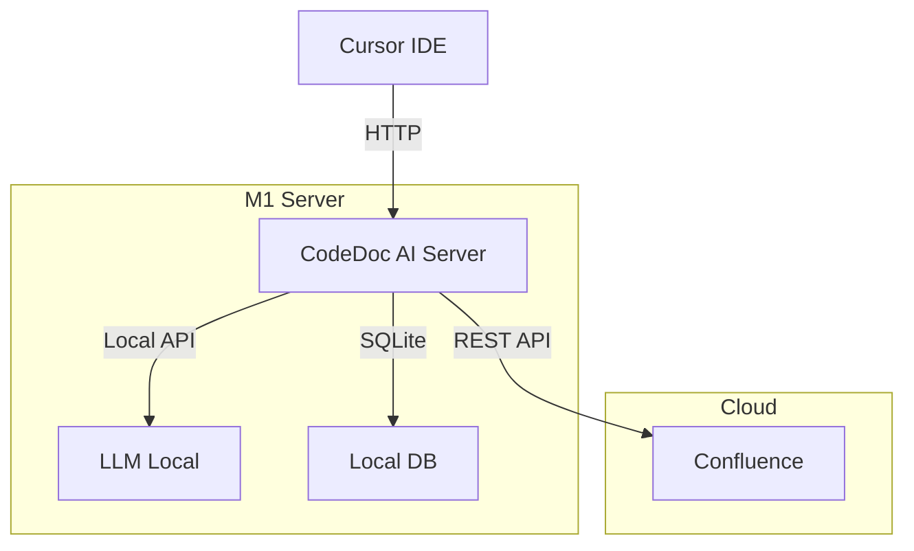
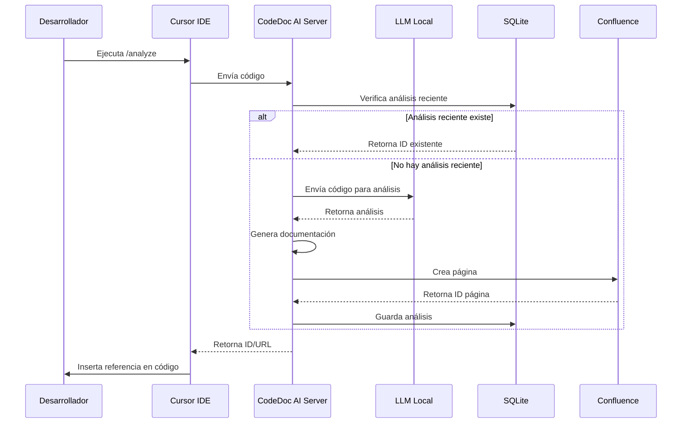

## Índice

0. [Ficha del proyecto](#0-ficha-del-proyecto)
1. [Descripción general del producto](#1-descripción-general-del-producto)
2. [Arquitectura del sistema](#2-arquitectura-del-sistema)
3. [Modelo de datos](#3-modelo-de-datos)
4. [Especificación de la API](#4-especificación-de-la-api)
5. [Historias de usuario](#5-historias-de-usuario)
6. [Tickets de trabajo](#6-tickets-de-trabajo)
7. [Pull requests](#7-pull-requests)

---

## 0. Ficha del proyecto

### **0.1. Tu nombre completo:**

Julio José González Cordón

### **0.2. Nombre del proyecto:**

CodeDoc AI

### **0.3. Descripción breve del proyecto:**

CodeDoc AI es una herramienta de documentación automatizada que utiliza IA local para generar documentación técnica detallada en Confluence, enfocándose en la lógica y funcionalidad del código.

### **0.4. URL del proyecto:**

https://github.com/JulioGT/AI4Devs-finalproject

### 0.5. URL o archivo comprimido del repositorio

---

## 1. Descripción general del producto

### 1.1. Objetivo:

CodeDoc AI es una herramienta de documentación automatizada que utiliza IA local para generar documentación técnica detallada en Confluence, enfocándose en la lógica y funcionalidad del código. El producto:

- Genera documentación técnica precisa y detallada de la lógica de negocio
- Analiza código de forma inteligente usando LLM local
- Crea páginas estructuradas en Confluence
- Mantiene un estándar de calidad consistente
- Reduce el tiempo de documentación manual
- Centraliza la documentación técnica del proyecto

### 1.2. Características y funcionalidades principales:

1. **Análisis de Código Inteligente**

   - Análisis de lógica de negocio:
     - Identificación de la funcionalidad principal
     - Documentación de flujos de datos
     - Explicación de transformaciones de datos
     - Descripción de reglas de negocio
     - Documentación de condiciones y decisiones
   - Integración con Cursor IDE
   - Soporte para múltiples lenguajes de programación
   - Generación de documentación contextual

2. **Generación de Documentación de Lógica**

   - Estructura enfocada en funcionalidad:
     - Propósito y funcionalidad principal
     - Flujo de datos y transformaciones
     - Reglas de negocio implementadas
     - Condiciones y decisiones clave
     - Ejemplos de flujos típicos
   - Diagramas de flujo de datos:
     - Entradas y salidas
     - Transformaciones de datos
     - Puntos de decisión
   - Ejemplos de código con explicación de lógica
   - Casos de uso típicos

3. **Integración con Confluence**

   - Creación de páginas de documentación técnica
   - Formato claro y enfocado en lógica
   - Actualización automática
   - Referencias cruzadas entre componentes relacionados

4. **Interfaz de Usuario**
   - Comando simple en Cursor: `/analyze`
   - Feedback en tiempo real
   - Inserción automática de referencias
   - Visualización de estado de documentación

### 1.3. Diseño y experiencia de usuario:

Flujo de usuario típico:

1. **Inicio del Análisis**

   ```bash
   # En Cursor IDE
   /analyze
   ```

2. **Proceso de Documentación**

   - El sistema analiza el código
   - Genera documentación detallada de la lógica
   - Crea página en Confluence
   - Devuelve referencia al código

3. **Resultado en el Archivo**

   ```javascript
   /**
    * Documentación: https://your-domain.atlassian.net/wiki/spaces/SPACE/pages/123456
    * ID: 123456
    * Última actualización: 2024-03-20
    */

   // Resto del código original...
   ```

4. **Página en Confluence**
   - Documentación de lógica de negocio
   - Diagramas de flujo de datos
   - Ejemplos de código
   - Casos de uso

### 1.4. Instrucciones de instalación:

> **Nota**: Esta sección detalla el proceso de instalación inicial del proyecto en la M1, que es el componente central del sistema.

#### Requisitos Previos

- M1 Mac con:
  - macOS 12.0 o superior
  - 16GB+ RAM
  - Node.js v18.17.0 o superior
  - Git
- Confluence:
  - Cuenta de administrador
  - API Token básico

#### Estructura del Repositorio (MVP)

---

## 2. Arquitectura del Sistema

### 2.1. Diagrama de arquitectura:

**Diagrama de Componentes:**



**Diagrama de Flujo del Proceso:**



**Justificación de la Arquitectura:**

- **Arquitectura Simple**: Diseño enfocado en MVP de 36 horas
- **LLM Local**: Ejecución directa en M1 para mejor rendimiento
- **SQLite**: Almacenamiento simple de análisis recientes
- **API REST**: Comunicación simple y estándar

**Flujo de Documentación:**

1. El desarrollador inicia el análisis desde Cursor
2. El servidor verifica si existe un análisis reciente
3. Si no existe, el LLM analiza el código y genera documentación
4. Se crea una página en Confluence con la documentación
5. Se almacena la referencia en SQLite
6. Se devuelve la referencia al código
7. Cursor inserta la referencia en el archivo

**Beneficios del Flujo:**

- Evita re-análisis innecesarios
- Mantiene documentación actualizada
- Proceso transparente para el desarrollador
- Referencias automáticas en el código

### 2.2. Descripción de componentes principales:

1. **Servidor Node.js (CodeDoc AI Server)**

   - Express.js para API REST
   - Manejo de análisis de código
   - Generación de documentación
   - Integración con Confluence
   - Almacenamiento simple en SQLite

2. **LLM Local (Mistral 7B)**

   - Modelo: Mistral-7B-Instruct
   - Framework: llama.cpp
   - Memoria: 8GB RAM
   - GPU: Neural Engine M1
   - Enfoque: Análisis de lógica de código

3. **Base de Datos (SQLite)**

   - Almacenamiento de últimos análisis (últimas 24 horas)
   - Estructura simple:
     ```sql
     CREATE TABLE analysis (
       id TEXT PRIMARY KEY,
       file_path TEXT,
       confluence_page_id TEXT,
       created_at TIMESTAMP,
       status TEXT
     );
     ```
   - Útil para:
     - Evitar re-análisis del mismo archivo en corto tiempo
     - Tracking básico de documentación generada
     - Referencia rápida de páginas de Confluence

4. **Integración Cursor**
   - Comando `/analyze`
   - Envío de código
   - Recepción de documentación
   - Inserción de referencias

### 2.3. Descripción de alto nivel del proyecto y estructura de ficheros:

```
project/
├── src/
│   ├── server/           # Servidor Node.js
│   │   ├── api/         # Endpoints REST
│   │   ├── llm/         # Integración con Mistral
│   │   ├── confluence/  # Cliente Confluence
│   │   └── db/          # Operaciones SQLite
│   └── cursor/          # Extensión Cursor
├── config/              # Configuraciones
├── scripts/            # Scripts de instalación
└── docs/              # Documentación adicional
```

### 2.4. Infraestructura y despliegue:

- **Local**: Ejecución en M1 Mac
- **Requisitos**: Node.js, Git, API Token Confluence
- **Despliegue**: Instalación local vía npm

### 2.5. Seguridad:

- Autenticación básica para API Confluence
- Manejo seguro de tokens
- Ejecución local del LLM

### 2.6. Tests:

- **Test de Flujo Principal**: Validación manual del proceso completo
- **Test de Casos Básicos**: Pruebas con archivos JavaScript/TypeScript simples

---

## 3. Modelo de Datos

### **3.1. Diagrama del modelo de datos:**

```sql
-- Tabla de análisis (SQLite)
CREATE TABLE analysis (
    id TEXT PRIMARY KEY,        -- UUID del análisis
    file_path TEXT,            -- Ruta del archivo analizado
    confluence_page_id TEXT,    -- ID de la página en Confluence
    created_at TIMESTAMP,       -- Fecha de creación
    status TEXT                 -- Estado del análisis
);
```

### **3.2. Descripción de entidades principales:**

1. **Entrada**:

   - Código fuente del archivo
   - Metadatos del archivo (ruta, tipo)

2. **Procesamiento**:

   - Análisis por LLM
   - Generación de documentación
   - Creación en Confluence

3. **Salida**:
   - ID de página Confluence
   - URL de documentación
   - Referencia en código

---

## 4. Especificación de la API

### 4.1. Endpoints:

#### POST /api/analyze

```json
// Request
{
    "filePath": "string",
    "code": "string",
    "language": "string"
}

// Response
{
    "pageId": "string",
    "pageUrl": "string",
    "status": "success"
}
```

#### GET /api/status/:analysisId

```json
// Response
{
  "status": "string",
  "pageId": "string",
  "pageUrl": "string"
}
```

### 4.2. Integración Confluence:

- **Creación de Página**:

  - Título: Nombre del archivo
  - Contenido: Documentación generada
  - Espacio: Configurado en settings

- **Actualización**:
  - Solo si el análisis es nuevo
  - Mantiene historial de versiones

---

## 5. Historias de Usuario

### 5.1. Como desarrollador, quiero:

- Documentar automáticamente la lógica de mi código
- Tener referencias directas a la documentación en el código
- Evitar documentación duplicada
- Mantener la documentación actualizada

### 5.2. Como líder técnico, quiero:

- Tener documentación consistente del proyecto
- Centralizar la documentación en Confluence
- Reducir el tiempo de documentación manual
- Mantener un estándar de calidad

---

## 6. Tickets de Trabajo

### 6.1. MVP (36 horas):

1. **Setup Inicial** (4h)

   - [ ] Configuración del proyecto Node.js
   - [ ] Instalación de dependencias
   - [ ] Configuración de LLM local

2. **Servidor Base** (6h)

   - [ ] Implementación de API REST
   - [ ] Integración con SQLite
   - [ ] Manejo de errores básico

3. **Análisis de Código** (8h)

   - [ ] Integración con LLM
   - [ ] Generación de documentación
   - [ ] Pruebas con diferentes lenguajes

4. **Integración Confluence** (6h)

   - [ ] Cliente Confluence
   - [ ] Creación de páginas
   - [ ] Manejo de referencias

5. **Extensión Cursor** (8h)

   - [ ] Comando /analyze
   - [ ] Envío de código
   - [ ] Inserción de referencias

6. **Testing y Ajustes** (4h)
   - [ ] Pruebas de flujo principal
   - [ ] Ajustes de documentación
   - [ ] Corrección de errores

---

## 7. Pull Requests

**Pull Request 1**

**Pull Request 2**

**Pull Request 3**
